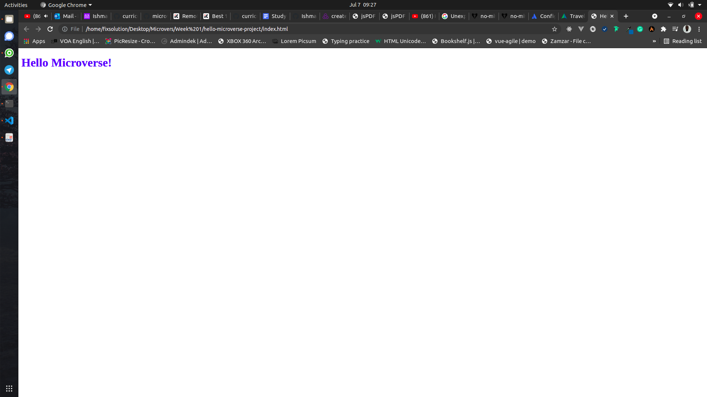

# Hello Microverse Project

> Hello microverse is a beginer for me to show what I have learn

Additional description about the project and its features.

## Built With

- Html & Css
- Github workflows

## Authors

👤 **Author1**

- GitHub: [@ishmaelkargbo](https://github.com/ishmaelkargbo)
- Twitter: [@IshoKargbo](https://twitter.com/IshoKargbo)
- LinkedIn: [LinkedIn](https://linkedin.com/in/ishmael-kargbo-9a986a214)

## 🤝 Contributing

Contributions, issues, and feature requests are welcome!

Feel free to check the [issues page](../../issues/).

## Show your support

Give a ⭐️ if you like this project!

## Acknowledgments

- Hat tip to anyone whose code was used
- Inspiration
- etc

## 📝 License

This project is [MIT](./MIT.md) licensed.

